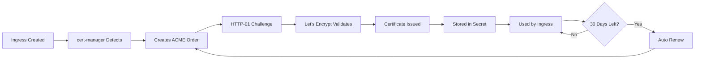

# SSL/TLS Configuration for Multi-Adapter Deployment

## Overview

This directory contains automated SSL/TLS certificate management using **cert-manager** and **Let's Encrypt** to secure all public-facing endpoints with HTTPS encryption.

## Features

✅ **Automated Certificate Issuance**: Let's Encrypt certificates auto-renewed every 60 days  
✅ **TLS 1.2/1.3 Support**: Modern encryption protocols only  
✅ **Security Headers**: HSTS, X-Frame-Options, CSP, etc.  
✅ **Rate Limiting**: 50 requests/second, 100 concurrent connections  
✅ **Multiple Environments**: Production, Staging, and Self-signed options  
✅ **Force HTTPS**: Automatic HTTP → HTTPS redirect  

## Quick Start

### Step 1: Configure SSL

```bash
cd /home/daclab-ai/k3s-multicloud-config/k3s-manifests/llama3-deployment/multi-adapter/ssl
./configure-ssl.sh
```

**You will be prompted for:**
- Domain name (e.g., `ollama.yourdomain.com`)
- Email address (for Let's Encrypt notifications)
- Environment (staging, production, or self-signed)

### Step 2: Deploy SSL

```bash
./deploy-ssl.sh
```

This will:
1. Install cert-manager (if not already installed)
2. Create ClusterIssuers (Let's Encrypt configuration)
3. Deploy TLS-enabled ingress
4. Wait for SSL certificate to be issued
5. Verify configuration

### Step 3: Verify

```bash
# Check certificate status
kubectl get certificate -n llama3-multi-adapter

# Test HTTPS endpoint
curl -v https://your-domain.com/base/api/tags

# Check certificate details
kubectl describe certificate ollama-tls-cert -n llama3-multi-adapter
```

## Prerequisites

### 1. Domain Name

You need a **public domain name** that points to your cluster:

```bash
# Check your cluster's external IP
kubectl get svc -n ingress-nginx ingress-nginx-controller

# Your DNS A record should point to this IP:
# ollama.yourdomain.com → <external-ip>
```

### 2. Port Access

Ports **80** and **443** must be accessible from the internet:

```bash
# Test port 80 (HTTP - needed for Let's Encrypt validation)
curl http://your-domain.com

# Test port 443 (HTTPS)
curl https://your-domain.com
```

### 3. Nginx Ingress Controller

```bash
# Check if nginx ingress is installed
kubectl get pods -n ingress-nginx

# If not, install it:
kubectl apply -f https://raw.githubusercontent.com/kubernetes/ingress-nginx/controller-v1.9.4/deploy/static/provider/cloud/deploy.yaml
```

## Certificate Issuers

### Production (letsencrypt-prod)

- **Use for**: Production deployments
- **Rate Limits**: 50 certificates per registered domain per week
- **Trusted**: Yes, by all browsers
- **Renewal**: Automatic every 60 days

### Staging (letsencrypt-staging)

- **Use for**: Testing and development
- **Rate Limits**: Much higher (thousands per week)
- **Trusted**: No, browsers will show warnings
- **Renewal**: Automatic every 60 days

### Self-Signed (selfsigned-issuer)

- **Use for**: Local testing without domain
- **Rate Limits**: None
- **Trusted**: No, browsers will show warnings
- **Renewal**: Not needed (no expiry)

## Files

```
ssl/
├── README-SSL.md                # This file
├── cluster-issuer.yaml          # Let's Encrypt configuration
├── ingress-tls.yaml             # HTTPS ingress with TLS
├── configure-ssl.sh             # Interactive configuration
├── deploy-ssl.sh                # Automated deployment (generated)
└── setup-cert-manager.sh        # cert-manager installation
```

## Security Features

### TLS Configuration

```yaml
# Protocols: TLS 1.2 and 1.3 only
ssl-protocols: "TLSv1.2 TLSv1.3"

# Strong cipher suites
ssl-ciphers: "ECDHE-ECDSA-AES128-GCM-SHA256:ECDHE-RSA-AES128-GCM-SHA256:ECDHE-ECDSA-AES256-GCM-SHA384:ECDHE-RSA-AES256-GCM-SHA384"
```

### Security Headers

| Header | Value | Purpose |
|--------|-------|---------|
| `Strict-Transport-Security` | `max-age=31536000` | Force HTTPS for 1 year |
| `X-Content-Type-Options` | `nosniff` | Prevent MIME sniffing |
| `X-Frame-Options` | `DENY` | Prevent clickjacking |
| `X-XSS-Protection` | `1; mode=block` | XSS protection |

### Rate Limiting

- **50 requests/second** per IP address
- **100 concurrent connections** per IP address

## Endpoints

Once SSL is deployed, all endpoints are accessible via HTTPS:

```
https://your-domain.com/base           # Base model
https://your-domain.com/chatbot        # Chatbot adapter
https://your-domain.com/code           # Code adapter
https://your-domain.com/summarization  # Summarization adapter
https://your-domain.com/health         # Health check
```

**HTTP requests are automatically redirected to HTTPS.**

## Troubleshooting

### Certificate Not Issued

```bash
# Check certificate status
kubectl describe certificate ollama-tls-cert -n llama3-multi-adapter

# Check cert-manager logs
kubectl logs -n cert-manager deployment/cert-manager -f

# Check ACME challenge
kubectl get challenges -n llama3-multi-adapter
```

**Common issues:**

1. **DNS not pointing to cluster**: Verify with `nslookup your-domain.com`
2. **Port 80 not accessible**: Let's Encrypt needs HTTP for validation
3. **Rate limit hit**: Wait 1 week or use staging environment
4. **Firewall blocking**: Check firewall rules for ports 80/443

### Certificate Expired

cert-manager automatically renews certificates 30 days before expiry. If renewal fails:

```bash
# Force renewal
kubectl delete certificate ollama-tls-cert -n llama3-multi-adapter
kubectl apply -f ssl/ingress-tls.yaml
```

### Browser Shows "Not Secure"

**If using staging environment:**
- This is expected. Staging certificates are not trusted by browsers.
- For production, switch to `letsencrypt-prod` issuer.

**If using production environment:**
- Wait 1-2 minutes for certificate issuance
- Hard refresh browser (Ctrl+Shift+R)
- Check certificate status: `kubectl get certificate -n llama3-multi-adapter`

### Invalid Certificate Domain

If you change domains:

```bash
# Update SSL configuration
./configure-ssl.sh  # Enter new domain

# Redeploy
./deploy-ssl.sh
```

## Advanced Configuration

### Add Additional Domains

Edit `ssl/ingress-tls.yaml`:

```yaml
spec:
  tls:
  - hosts:
    - ollama.yourdomain.com
    - api.yourdomain.com      # Add this
    - llm.yourdomain.com       # Add this
    secretName: ollama-tls-cert
```

Then in the Certificate resource:

```yaml
spec:
  dnsNames:
  - ollama.yourdomain.com
  - api.yourdomain.com        # Add this
  - llm.yourdomain.com         # Add this
```

### Custom Certificate Authority (CA)

For private/internal CAs:

```yaml
apiVersion: cert-manager.io/v1
kind: ClusterIssuer
metadata:
  name: private-ca
spec:
  ca:
    secretName: ca-key-pair  # Your CA cert and key
```

### Wildcard Certificates

Requires DNS-01 challenge (not HTTP-01):

```yaml
spec:
  acme:
    solvers:
    - dns01:
        cloudflare:  # or route53, cloudDNS, etc.
          email: admin@yourdomain.com
          apiTokenSecretRef:
            name: cloudflare-api-token
            key: api-token
```

### Certificate Monitoring

Set up alerts for certificate expiry:

```yaml
apiVersion: v1
kind: ConfigMap
metadata:
  name: cert-monitor
data:
  check.sh: |
    #!/bin/bash
    EXPIRY=$(kubectl get secret ollama-tls-cert -n llama3-multi-adapter -o jsonpath='{.data.tls\.crt}' | base64 -d | openssl x509 -noout -enddate | cut -d= -f2)
    DAYS_LEFT=$(( ($(date -d "$EXPIRY" +%s) - $(date +%s)) / 86400 ))
    
    if [ $DAYS_LEFT -lt 30 ]; then
        echo "WARNING: Certificate expires in $DAYS_LEFT days!"
    else
        echo "Certificate valid for $DAYS_LEFT more days"
    fi
```

## Certificate Lifecycle



## Rate Limits

### Let's Encrypt Production

- **50 certificates** per registered domain per week
- **5 duplicate certificates** per week
- **300 new orders** per account per 3 hours
- **10 failed validations** per hour

### Let's Encrypt Staging

- **30,000 new orders** per account per 3 hours
- Much higher limits for testing

### Best Practices

1. **Always test with staging first**
2. **Don't delete and recreate certificates frequently**
3. **Use wildcard certs for multiple subdomains**
4. **Monitor certificate expiry**

## Security Checklist

- [x] TLS 1.2/1.3 only
- [x] Strong cipher suites
- [x] HSTS enabled (1 year)
- [x] HTTP → HTTPS redirect
- [x] Security headers configured
- [x] Rate limiting enabled
- [x] XSS protection
- [x] Clickjacking protection
- [x] MIME sniffing prevention
- [x] Automatic certificate renewal

## Support

### Check Status

```bash
# All SSL components
kubectl get clusterissuer
kubectl get certificate -n llama3-multi-adapter
kubectl get secret ollama-tls-cert -n llama3-multi-adapter
kubectl get ingress -n llama3-multi-adapter

# cert-manager health
kubectl get pods -n cert-manager
kubectl logs -n cert-manager deployment/cert-manager
```

### Debug Certificate Issues

```bash
# Detailed certificate info
kubectl describe certificate ollama-tls-cert -n llama3-multi-adapter

# Check ACME challenges
kubectl get challenges -n llama3-multi-adapter
kubectl describe challenges -n llama3-multi-adapter

# View certificate details
kubectl get secret ollama-tls-cert -n llama3-multi-adapter -o jsonpath='{.data.tls\.crt}' | base64 -d | openssl x509 -text -noout
```

## References

- [cert-manager Documentation](https://cert-manager.io/docs/)
- [Let's Encrypt Rate Limits](https://letsencrypt.org/docs/rate-limits/)
- [Nginx Ingress TLS](https://kubernetes.github.io/ingress-nginx/user-guide/tls/)
- [TLS Best Practices](https://wiki.mozilla.org/Security/Server_Side_TLS)
